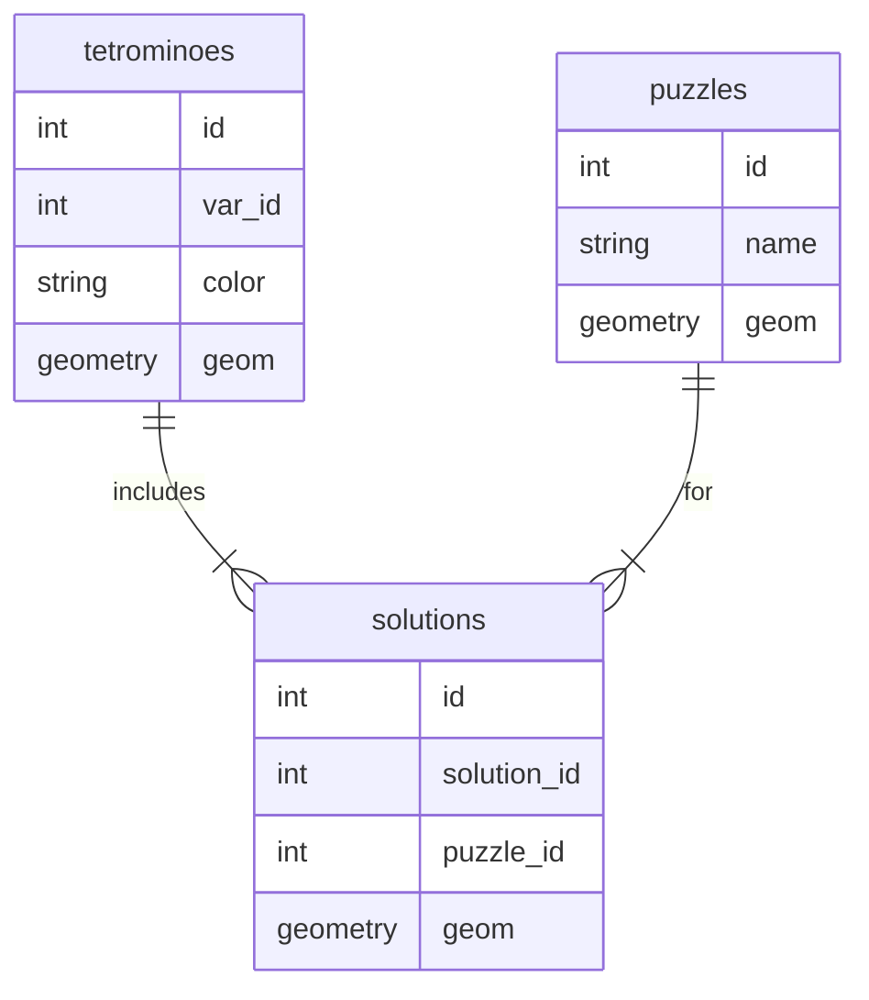

# Practical Assignment of Advanced Topics in Databases

**author: Lourenço Antunes, Pedro Magalhães, Giuseppe**

**date: May 28, 2025**

## Introduction and Assumptions

This project implements a solver that fits 7 distinct tretominoes (including their corresponding rotations) into a pre-defined grid (the puzzle). Each puzzle can be a simple grid or it can contain empty holes for additional complexity.
The following design decisions were taken

